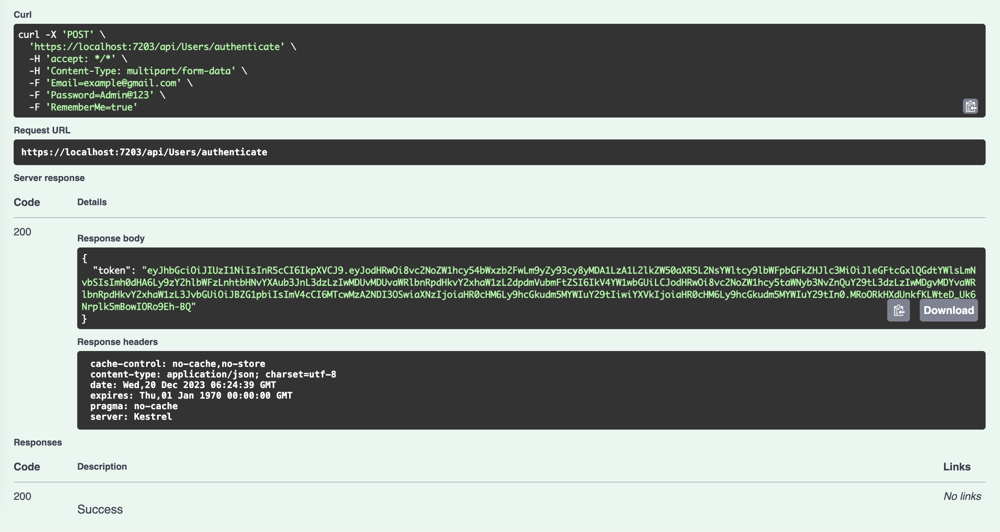

# Part 12: Authentication JWT API with Identity

>This tutorial teaches you how to create a login API, register users, use JWT authentication with Identity.

In this section:

- Create UsersService
- Create UsersApiController using JWT authentication

Before coming to this guide, please refer to [Part 11: Add Identity on ASP.NET Core](https://github.com/NguyenPhuDuc307/add-identity).

## Add JwtOptions configuration

Add the following configuration to your `appsettings.Development.json` configuration:

```json
"JwtOptions": {
    "SigningKey": "this is my custom Secret key for authentication",
    "Issuer": "https://api.vnLab.com",
    "Audience": "https://api.vnLab.com"
  }
```

Create the `JwtOptions.cs` class in `ViewModels`:

```c#
namespace CourseManagement.ViewModels
{
    public class JwtOptions
    {
        public string? Issuer { get; set; }
        public string? Audience { get; set; }
        public string? SigningKey { get; set; }
    }
}
```

Add `JwtOptions` configuration in `Program.cs` file:

```c#
//Jwt Authentication
builder.Services.Configure<JwtOptions>(builder.Configuration.GetSection("JwtOptions"));
```

## Add a Request and ViewModel for User

Add a file named UserViewModel.cs to the ViewModels folder, create it in your project's source folder.

Update the ViewModels/UserViewModel.cs file with the following code:

```c#
using System.ComponentModel;
using System.ComponentModel.DataAnnotations;

namespace CourseManagement.ViewModels
{
    public class UserViewModel
    {
        public string? Id { get; set; }
        public string? FullName { get; set; }
        [DataType(DataType.Date)]
        public DateTime Dob { get; set; }
        public string? Email { get; set; }
        [DisplayName("User Name")]
        public string? UserName { get; set; }
        [DisplayName("Phone Number")]
        public string? PhoneNumber { get; set; }
        public string? Password { get; set; }
        [DisplayName("Password Confirm")]
        public string? PasswordConfirm { get; set; }
    }

    public class RegisterRequest
    {
        [Required]
        public string? FullName { get; set; }
        [Required]
        [DataType(DataType.Date)]
        public DateTime Dob { get; set; }
        [Required]
        [EmailAddress(ErrorMessage = "Invalid email address")]
        public string? Email { get; set; }
        [Phone]
        [DisplayName("Phone Number")]
        public string? PhoneNumber { get; set; }
        [Required]
        [RegularExpression(@"^(?=.*[a-z])(?=.*[A-Z])(?=.*\d).{8,}$", ErrorMessage = "Password must be at least 8 characters long and contain at least one lowercase letter, one uppercase letter, and one digit")]
        public string? Password { get; set; }
        [Compare("Password", ErrorMessage = "Passwords do not match")]
        [DisplayName("Password Confirm")]
        public string? PasswordConfirm { get; set; }
    }

    public class LoginRequest
    {
        [Required]
        [EmailAddress]
        public string? Email { get; set; }
        [Required]
        [RegularExpression(@"^(?=.*[a-z])(?=.*[A-Z])(?=.*\d).{8,}$", ErrorMessage = "Password must be at least 8 characters long and contain at least one lowercase letter, one uppercase letter, and one digit")]
        public string? Password { get; set; }
        [DisplayName("Remember Me?")]
        public bool RememberMe { get; set; }
    }
}
```

## Create interfaces and class for services for User

Create a new interface named IUsersService in the Services folder. Replace the generated code with the following:

```c#
using CourseManagement.ViewModels;

namespace CourseManagement.Services
{
    public interface IUsersService
    {
        Task<string> Authenticate(LoginRequest request);

        Task<bool> Register(RegisterRequest request);
    }
}
```

Create a new class named UsersService in the Services folder. This class implement IUsersService interface. Replace the generated code with the following:

```cs
using AutoMapper;
using CourseManagement.Data.Entities;
using CourseManagement.ViewModels;
using Microsoft.AspNetCore.Identity;
using Microsoft.Extensions.Options;
using Microsoft.IdentityModel.Tokens;
using System.IdentityModel.Tokens.Jwt;
using System.Security.Claims;
using System.Text;

namespace CourseManagement.Services
{
    public class UsersService : IUsersService
    {
        private readonly UserManager<User> _userManager;
        private readonly SignInManager<User> _signInManager;
        private readonly RoleManager<IdentityRole> _roleManager;
        private readonly IConfiguration _config;
        private readonly IMapper _mapper;
        private readonly JwtOptions _jwtOptions;

        public UsersService(UserManager<User> userManager,
        SignInManager<User> signInManager,
        RoleManager<IdentityRole> roleManager,
        IConfiguration config,
        IMapper mapper,
        IOptions<JwtOptions> jwtOptions)
        {
            _userManager = userManager;
            _signInManager = signInManager;
            _roleManager = roleManager;
            _config = config;
            _mapper = mapper;
            _jwtOptions = jwtOptions.Value;
        }

        public async Task<string> Authenticate(LoginRequest request)
        {
            var user = await _userManager.FindByNameAsync(request.Email!);

            if (user == null)
            {
                throw new Exception("Couldn't find user with email " + request.Email);
            }

            var result = await _signInManager.PasswordSignInAsync(user, request.Password!, request.RememberMe, true);
            if (!result.Succeeded)
            {
                throw new Exception("Couldn't sign in");
            }
            var roles = await _userManager.GetRolesAsync(user);
            var claims = new[]
            {
                new Claim(ClaimTypes.Email,user.Email!),
                new Claim(ClaimTypes.GivenName,user.FullName!),
                new Claim(ClaimTypes.Role, string.Join(";",roles))
            };
            var key = new SymmetricSecurityKey(Encoding.UTF8.GetBytes(_jwtOptions.SigningKey!));
            var signingCredentials = new SigningCredentials(key, SecurityAlgorithms.HmacSha256);

            var token = new JwtSecurityToken(
                _jwtOptions.Issuer,
                _jwtOptions.Audience,
                claims,
                expires: DateTime.Now.AddHours(3),
                signingCredentials: signingCredentials);

            return new JwtSecurityTokenHandler().WriteToken(token);
        }

        public async Task<bool> Register(RegisterRequest request)
        {
            var user = _mapper.Map<User>(request);
            var result = await _userManager.CreateAsync(user, request.Password!);
            return result.Succeeded;
        }
    }
}
```

For register services for DI, let's add the following code in `Program.cs`:

```c#
builder.Services.AddTransient<IUsersService, UsersService>();
```

## Create a UsersApiController

Add `UsersApiController.cs` in `Controller`:

```cs
using CourseManagement.Services;
using CourseManagement.ViewModels;
using Microsoft.AspNetCore.Authorization;
using Microsoft.AspNetCore.Mvc;

namespace CourseManagement.Controllers
{
    [Route("api/[controller]")]
    [ApiController]
    public class UsersController : ControllerBase
    {
        private readonly IUsersService _usersService;

        public UsersController(IUsersService usersService)
        {
            _usersService = usersService;
        }

        [HttpPost("authenticate")]
        [AllowAnonymous]
        public async Task<IActionResult> Authenticate([FromForm] LoginRequest request)
        {
            if (!ModelState.IsValid)
                return BadRequest(ModelState);

            var resultToken = await _usersService.Authenticate(request);
            return string.IsNullOrEmpty(resultToken) ? BadRequest("Username or password is incorrect.") : Ok(new { token = resultToken });
        }

        [HttpPost("register")]
        [AllowAnonymous]
        public async Task<IActionResult> Register([FromForm] RegisterRequest request)
        {
            if (!ModelState.IsValid)
                return BadRequest(ModelState);

            var result = await _usersService.Register(request);
            return !result ? BadRequest("Register is unsuccessful.") : Ok();
        }
    }
}
```

## Final, run the application to test functions

Run the following command:

```bash
dotnet watch run
```



Next let's [Part 13: Add Authorization header for Swagger](https://github.com/NguyenPhuDuc307/auth-swagger).
